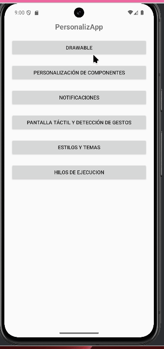
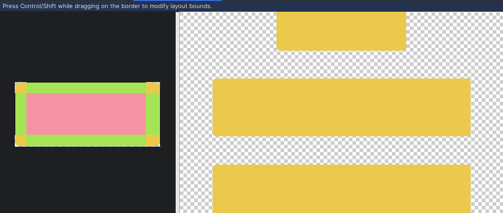

# Android Avanzado
Para esta práctica he creado una única aplicación llamada _PersonalizApp_. La pantalla principal nos permitirá ver que práctica queremos visualizar según el botón que pulsemos. En caso de tener algún problema visualizando la práctica se puede consultar en [GitHub](https://github.com/solsolet/PersonalizApp.git).
Este readme no estará finalizado seguramente para cuando se lea la entrega de Moodle, no me ha dado tiempo a terminarlo intetnando acabar los ejercicios rápidamente. Si se consulta el repositoio en GitHub seguramente se pueda ver actualizado. 
## Sesión 8
Para ver el funcionamiento de todos los ejercicios, se puede ver en el vídeo  en la carpeta `img-readme`.
### Drawables
Accedemos al pulsar el primer botón `Drawables`.
#### Ejercicio 1. Personalización del aspecto
<!-- Explicació activitat -->
Para hacer este ejercicio he creado los ficheros:
+ `Drawables.kt`: clase donde irá todo el código de la aplicación. No tiene nada puesto todavía.
+ `drawables.xml`: layout para la clase `Drawables`. Tiene el elemento _TextView_ que se pide.
```xml
<?xml version="1.0" encoding="utf-8"?>
<androidx.constraintlayout.widget.ConstraintLayout xmlns:android="http://schemas.android.com/apk/res/android"
    xmlns:app="http://schemas.android.com/apk/res-auto"
    android:layout_width="match_parent"
    android:layout_height="match_parent">

    <TextView
        android:id="@+id/textViewDrawable"
        android:layout_width="match_parent"
        android:layout_height="wrap_content"
        android:background="@drawable/fondo"
        android:gravity="center"
        android:text="@string/drawable"
        android:textColor="@color/black"
        app:layout_constraintBottom_toBottomOf="parent"
        app:layout_constraintEnd_toEndOf="parent"
        app:layout_constraintHorizontal_bias="0.5"
        app:layout_constraintStart_toStartOf="parent"
        app:layout_constraintTop_toTopOf="parent"
        app:layout_constraintVertical_bias="0.5" />
</androidx.constraintlayout.widget.ConstraintLayout>
```
+ `fondo.xml`: elemento drawable dentro de la carpeta `res/drawable`. Tiene las etiquetas para darle aspecto al _drawable_.
```xml
<?xml version="1.0" encoding="utf-8"?>
<shape xmlns:android="http://schemas.android.com/apk/res/android"
    android:shape="rectangle">
    <stroke android:color="@color/blue" android:width="5dp"/>
    <corners android:radius="5dp"/>
    <gradient
        android:type="linear"
        android:startColor="@color/light_grey"
        android:endColor="@color/white" />
    <padding
        android:left="5dp"
        android:top="5dp"
        android:right="5dp"
        android:bottom="5dp" />
</shape>
```
+ `colors.xml`: este no lo he creado yo, pero lo he aprovechado para definir los colores que voy a usar. De momento solo he definido `blue` y `light_grey`.
<!-- Respostes a preguntes-->
El margen se puede definir dentro de la definición de _drawable_ con la etiqueta `<padding>`. Des del layout también sería posible con `android:padding`.

#### Ejercicio 2. Personalización de los botones
He creado las imágenes con GIMP con los colores correspondientes y las he añadido al proyecto en la carpeta de drawables. Para usarlas en el botón he creado `boton_imagen` de la siguiente manera: 
```xml
<selector xmlns:android="http://schemas.android.com/apk/res/android">
    <!-- presionado : gris oscuro -->
    <item android:state_pressed="true"
        android:drawable="@drawable/boton_pressed" />
    <!-- seleccionado : amarillo -->
    <item android:state_focused="true"
        android:drawable="@drawable/boton_focused" />
    <!-- normal: no seleccionado ni presionado : gris claro -->
    <item android:drawable="@drawable/boton_normal" />
</selector>
```
Este código se ha usado para el botón `buttonPersonalizado` como fondo: `android:background="@drawable/boton_imagen"`. El resultado ha sido que al ejecutar la aplicación, el botón por defecto está gris oscuro, si lo pulsamos gris claro y si le damos el foco (con _tab_) amarillo.

Las esquinas por suerte no se ven estiradas, pero por si acaso he implementado la versión con 9-patches .

#### Ejercicio 3. Animación por fotogramas
Para animar he añadido un elemento `ProgressBar` al cual en su atributo `indterminateDrawable` le he puesto `animacion` que es una `animation-list`. Esta lista animada se repite en bucle gracia al atributo `oneshot="false"`.
```xml
<ProgressBar
    android:id="@+id/progressBar"
    style="?android:attr/progressBarStyle"
    android:layout_width="wrap_content"
    android:layout_height="wrap_content"
    android:layout_marginTop="52dp"
    android:indeterminateDrawable="@drawable/animacion"
    app:layout_constraintEnd_toEndOf="parent"
    app:layout_constraintHorizontal_bias="0.5"
    app:layout_constraintStart_toStartOf="parent"
    app:layout_constraintTop_toBottomOf="@+id/buttonPersonalizado" />
```
```xml
<?xml version="1.0" encoding="utf-8"?>
<animation-list xmlns:android="http://schemas.android.com/apk/res/android"
    android:oneshot="false">
    <item android:drawable="@drawable/animacion1" android:duration="1000"/>
    <item android:drawable="@drawable/animacion2" android:duration="1000"/>
    <item android:drawable="@drawable/animacion3" android:duration="1000"/>
    <item android:drawable="@drawable/animacion4" android:duration="1000"/>
    <item android:drawable="@drawable/animacion5" android:duration="1000"/>
</animation-list>
```
#### Ejercicio 4. Niveles
Para los niveles he añadido una _SeekBar_ en `drawables.xml`. Se cambia el drawable que se muestra al cambiar la barra de valor con el atributo `progressDrawable` que usa el archivo `nivel_color.xml` para determinar a que rectángulo de color usar según el rango.
```xml
<SeekBar
    android:id="@+id/seekBar"
    android:layout_width="match_parent"
    android:layout_height="wrap_content"
    android:layout_marginTop="64dp"
    android:max="10000"
    android:progressDrawable="@drawable/nivel_color"
    app:layout_constraintEnd_toEndOf="parent"
    app:layout_constraintStart_toStartOf="parent"
    app:layout_constraintTop_toBottomOf="@+id/progressBar" />
```
He añadido nuevos colores en `values/colors.xml` para poder usar-los al crear os cuadrados de colores. Los cuadrados tienen de nombre "rs_[color]". 
```xml
<?xml version="1.0" encoding="utf-8"?>
<level-list xmlns:android="http://schemas.android.com/apk/res/android">
    <item android:minLevel="0" android:maxLevel="2500" android:drawable="@drawable/rs_green"/>
    <item android:minLevel="2501" android:maxLevel="5000" android:drawable="@drawable/rs_yellow"/>
    <item android:minLevel="5001" android:maxLevel="7500" android:drawable="@drawable/rs_orange"/>
    <item android:minLevel="7501" android:maxLevel="10000" android:drawable="@drawable/rs_red"/>
</level-list>
```
### Personalización de componentes
Los ejercicios se pueden visualizar si pulsamos el botón _Personalización Componentes_ en la página principal de la aplicación.
#### Ejercicio 1. Extensión de vistas
He creado la clase kotlin `TextViewCitas` con el decorador `@JvmOverloads`pra abreviar la sobrecarga de los constructores necesarios al heredar de vistas, dejándola así con este aspecto:
```kotlin
class TextViewCitas @JvmOverloads constructor(
    context: Context?,
    attrs: AttributeSet? = null,
    defStyle: Int = 0 ) : AppCompatTextView(context!!, attrs, defStyle) {

    private val listaCitas : Array<String> = resources.getStringArray(R.array.citas)

    init { citaAleatoria() }

    override fun onTouchEvent(event: MotionEvent): Boolean {
        citaAleatoria()
        return super.onTouchEvent(event)
    }
    private fun citaAleatoria(){
        text = listaCitas.random()
    }
}
```
Para la cita aleatoria, la función `citaAleatoria` llama al método random de un _Array<String>_ definido en `values/array_citas.xml` donde se recogen varias citas. La sobrecarga de onTouchEvent permite la funcionalidad que se pedía en el enunciado.

#### Ejercicio 2. Componentes compuestos
He creado otra clase de kotlin, `EdicionBorrable` y su elemento correspondiente en xml `edicion_borrable`. El funcionamiento es que de la clase llamamos al elemento layout i lo inflamos para poder usarlo.
```kotlin
package es.ua.eps.personalizapp

import android.content.Context
import android.util.AttributeSet
import android.view.LayoutInflater
import android.widget.Button
import android.widget.EditText
import android.widget.LinearLayout

class EdicionBorrable : LinearLayout {
    var editText: EditText? = null
    var button: Button? = null

    constructor(ctx: Context?) : super(ctx) {
        inicializar()
    }
    constructor(ctx: Context?, atts: AttributeSet?)
            : super(ctx, atts) {
        inicializar()
    }
    private fun inicializar() {
        // Create interface from layout
        val li = context.getSystemService(Context.LAYOUT_INFLATER_SERVICE) as LayoutInflater
        li.inflate(R.layout.edicion_borrable, this, true)

        // References child views
        editText = findViewById<EditText>(R.id.editText)!!
        button = findViewById<Button>(R.id.buttonBorrable)!!
    }
}
```
```xml
<?xml version="1.0" encoding="utf-8"?>
<LinearLayout xmlns:android="http://schemas.android.com/apk/res/android"
    android:layout_width="match_parent"
    android:layout_height="wrap_content"
    android:gravity="center"
    android:orientation="horizontal"
    android:padding="10dp">

    <EditText
        android:id="@+id/editText"
        android:layout_width="0dp"
        android:inputType="text"
        android:autofillHints="Escribe algo"
        android:layout_height="wrap_content"
        android:layout_weight="9" />

    <Button
        android:id="@+id/buttonBorrable"
        android:layout_width="0dp"
        android:layout_height="wrap_content"
        android:layout_weight="1"
        android:text="X" />
</LinearLayout>
```
Luego en `PersonalizaciónComp.kt` definimos unas variables para los para el campo de texto y el botón y definimos la funcionalidad con un `setOnClickListener`
```kotlin
//EdicionBorrable
val editText = findViewById<EditText>(R.id.editText)!!
val buttonX = findViewById<Button>(R.id.buttonBorrable)!!

buttonX.setOnClickListener { editText.setText("") }
```

#### Ejercicio 3. Componentes propios
He creado la clase `Grafica` que tiene un constructor abreviado y tiene varios métodos:
- `init`: coge el porcentaje que necesitamos para dibujar el sector.
- `onDraw`: dibuja el círculo y el sector según los parámetros que le demos.
- `onMeasure`: define el tamaño del elemento.
- `setPercentage`: define el porcentaje del sector según lo cambiemos en la interfaz en la _seekBar_.
```kotlin
class Grafica @JvmOverloads constructor(
    context: Context,
    attrs: AttributeSet? = null,
    defStyle: Int = 0 ) : View(context, attrs, defStyle) {

    private val DEFAULT_SIZE = 100
    private var percent = 0
    private var cX = 0F
    private var cY = 0F
    private var r = 0F

    init{
        if(attrs != null) {
            val ta = context.obtainStyledAttributes(attrs, R.styleable.Grafica)
            percent = ta.getInt(R.styleable.Grafica_percentage, 0)
        }
    }

    override fun onDraw(canvas: Canvas) {
        // red
        val red = Paint()
        red.style = Paint.Style.FILL
        red.color = Color.RED
        // blue
        val blue = Paint()
        blue.style = Paint.Style.FILL
        blue.color = Color.BLUE

        val angle = percent.toFloat() * 360f/100f

        super.onDraw(canvas)
        // Define how to draw the component
        canvas.drawCircle(cX, cY,r,  blue) // base circle
        canvas.drawArc(cX-r, cY-r, cX+r, cY+r, 0F, angle, true, red)
    }

    override fun onMeasure(widthMeasureSpec: Int, heightMeasureSpec: Int) {
        val widthMode = MeasureSpec.getMode(widthMeasureSpec)
        val widthSize = MeasureSpec.getSize(widthMeasureSpec)
        val heightMode = MeasureSpec.getMode(heightMeasureSpec)
        val heightSize = MeasureSpec.getSize(heightMeasureSpec)
        var width: Int = DEFAULT_SIZE
        var height = width // square
        when (widthMode) {
            MeasureSpec.EXACTLY -> width = widthSize
            MeasureSpec.AT_MOST -> if (width > widthSize) width = widthSize
        }
        when (heightMode) {
            MeasureSpec.EXACTLY -> height = heightSize
            MeasureSpec.AT_MOST -> if (height > heightSize) height = heightSize
        }

        cX = width / 2f
        cY = height /2f
        r = (width.coerceAtMost(height) / 2).toFloat()

        setMeasuredDimension(width, height)
    }

    fun setPercentage(per: Int) {
        percent = per
        invalidate()
    }
}
```
Y en `PersonalizacionCom` definimos la seekBar necesaria para modificar el porcentaje del sector:
```kotlin
seekBarGrafica.setOnSeekBarChangeListener(
    object : SeekBar.OnSeekBarChangeListener{
        override fun onProgressChanged(
            seekBar: SeekBar?,
            progress: Int,
            fromUser: Boolean
        ) {
            grafica.setPercentage(progress)
        }
        override fun onStartTrackingTouch(seekBar: SeekBar?) {}
        override fun onStopTrackingTouch(seekBar: SeekBar?) {}
    }
)
```
De este ejercicio destaco que lo que mas me ha costado cuadrar y que se vea bien es la posición del círculo en la vista, al principio salía el círculo cortado, o el sector no estaba bien alienado... pero al final la solución era más fácil de lo que yo intentaba hacer.

### Notificaciones
#### Ejercicio 1

#### Ejercicio 2

#### Ejercicio 3

#### Ejercicio 4
<!-- explicar metodo a método com va o posar en plan 1 perisos i ho fan estes funcions i les demanem en el onCreate, despres altres -->

## Sesión 10
Para ver el funcionamiento de todos los ejercicios, se puede ver en el vídeo  en la carpeta `img-readme`.
### Pantalla táctil
#### Ejercicio 1
Para hacer este ejercicio he creado la clase `PantallaCaja.kt` para implementar el componente propio.
<!--posar i explicar codi PantallaCaja-->

Luego lo he añadido al layout `pantalla.xml`:
```xml
<es.ua.eps.personalizapp.PantallaCaja
    android:id="@+id/caja"
    android:layout_width="match_parent"
    android:layout_height="match_parent"
    android:background="@color/material_dynamic_neutral80" />
```
#### Ejercicio 2
### Estilos y temas
La realización de este ejercicio ha afectado al aspecto eneral de la aplicación así que se puede comprobar facilmente. Si se entra a su apartado se pueden apreciar los botones creados a partir de `fondo_boton.xml`
### Hilos
Tras poner el código propuesto me salta el siguiente error:
```log
ANR in es.ua.eps.personalizapp (es.ua.eps.personalizapp/.MainActivity

PID: 6609
Reason: Input dispatching timed out (f20ec0d es.ua.eps.personalizapp/es.ua.eps.personalizapp.MainActivity is not responding. Waited 5000ms for FocusEvent(hasFocus=false)).
                                                                    Parent: es.ua.eps.personalizapp/.MainActivity
ErrorId: b231c25a-5b80-4e3e-a2a9-f85732731474
Frozen: false
Load: 0.57 / 0.22 / 0.4
                                                                    ----- Output from /proc/pressure/memory -----
                                                                                                                                       some avg10=0.07 avg60=0.18 avg300=0.06 total=15903740
                                                                    full avg10=0.02 avg60=0.05 avg300=0.01 total=7369562
                                                                    ----- End output from /proc/pressure/memory -----
                                                                    ----- Output from /proc/pressure/cpu -----
                                                                    some avg10=4.43 avg60=2.64 avg300=0.84 total=46979815
                                                                    full avg10=0.00 avg60=0.00 avg300=0.00 total=0
                                                                    ----- End output from /proc/pressure/cpu -----
                                                                    ----- Output from /proc/pressure/io -----
                                                                    some avg10=0.66 avg60=0.92 avg300=0.28 total=44353073
                                                                    full avg10=0.34 avg60=0.45 avg300=0.13 total=17963249
                                                                    ----- End output from /proc/pressure/io -----
                                                                    
                                                                    CPU usage from 27160ms to -1ms ago (2025-11-07 23:11:31.874 to 2025-11-07 23:11:59.035):
    12% 488/android.hardware.graphics.composer3-service.ranchu: 1.6% user + 11% kernel / faults: 1 minor 63 major
                                                                        12% 515/surfaceflinger: 3.6% user + 8.3% kernel / faults: 74 minor 3 major
                                                                    9.8% 693/system_server: 4% user + 5.7% kernel / faults: 21748 minor 589 major
                                                                        3.3% 952/com.android.systemui: 1.1% user + 2.2% kernel / faults: 3628 minor 103 major
                                                                        2.5% 1076/com.google.android.apps.nexuslauncher: 0.4% user + 2% kernel / faults: 180 minor 3 major
                                                                        0.6% 470/android.hardware.audio.service: 0.1% user + 0.4% kernel / faults: 9 minor
                                                                        0.5% 506/audioserver: 0.3% user + 0.2% kernel / faults: 3 minor 2 major
                                                                        0.4% 3151/com.android.vending: 0.2% user + 0.2% kernel / faults: 1818 minor 7291 major
                                                                        0.4% 484/android.hardware.sensors-service.multihal: 0.1% user + 0.2% kernel
                                                                        0.2% 56/kswapd0: 0% user + 0.2% kernel
                                                                    22% TOTAL: 5.4% user + 14% kernel + 1.3% iowait + 0.6% irq + 0.1% softirq
                                                                    CPU usage from 10ms to 273ms later (2025-11-07 23:11:59.045 to 2025-11-07 23:11:59.307):
                                                                        92% 515/surfaceflinger: 0% user + 92% kernel
    68% 575/RenderEngine: 0% user + 68% kernel
    20% 583/RegionSampling: 4% user + 16% kernel
    76% 6609/es.ua.eps.personalizapp: 9.5% user + 66% kernel / faults: 1260 minor 7 major
    57% 6627/RenderThread: 0% user + 57% kernel
    19% 6611/Signal Catcher: 9.5% user + 9.5% kernel
    20% 693/system_server: 4% user + 16% kernel / faults: 538 minor 2 major
    16% 6654/AnrAuxiliaryTas: 4% user + 12% kernel
    4% 1811/binder:693_F: 0% user + 4% kernel
    4% 488/android.hardware.graphics.composer3-service.ranchu: 0% user + 4% kernel
63% TOTAL: 7.7% user + 51% kernel + 3.3% iowait + 1.1% irq
```
Y se ha cerrado la aplicación. En otro intento se ve "Contador Terminado" en la actividad.